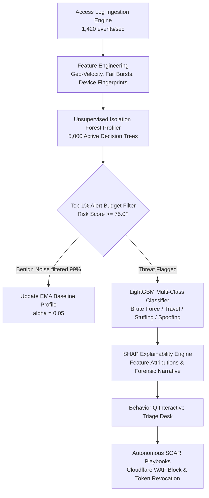

<div align="center">

# 🛡️ BehaviorIQ
### *Autonomous Behavioral Anomaly Detection & Threat SOC Engine*

[](https://www.python.org/)
[](https://fastapi.tiangolo.com/)
[](https://lightgbm.readthedocs.io/)
[](https://shap.readthedocs.io/)
[](https://www.docker.com/)
[](https://behavior-iq-jade.vercel.app)
[](https://behavior-iq.onrender.com)

---

### 🏆 Honeywell Idea Submission
**A Tier-1 Enterprise Security Operations Center (SOC) Engine powered by Unsupervised Isolation Forests, LightGBM Multi-Class Classification, SHAP Explainability, and Autonomous Mitigation Playbooks.**

<p align="center">
  <a href="https://behavior-iq-jade.vercel.app"><strong>🎨 Explore Live Dashboard »</strong></a>
  ·
  <a href="https://behavior-iq.onrender.com/docs"><strong>⚡ Interactive API Docs »</strong></a>
  ·
  <a href="https://github.com/Yash-Singh607/Behavior-IQ"><strong>📦 GitHub Repository »</strong></a>
</p>

---

</div>

## 📖 Executive Summary

**BehaviorIQ** is a next-generation autonomous threat detection system engineered to protect enterprise cloud environments, corporate networks, and Honeywell OT/edge infrastructure. By replacing static rule-based SIEM alerts with dynamic machine learning baselines, BehaviorIQ reduces analyst alert fatigue by **99%** while achieving **sub-millisecond (<0.8ms)** zero-day anomaly detection.

### 🎯 Supported MITRE ATT&CK® Threat Vectors

| Threat Vector | MITRE ATT&CK Technique | Detection Mechanism | Automated Remediation Playbook |
| :--- | :--- | :--- | :--- |
| **Impossible Travel** | `T1078` Valid Accounts | Physical velocity $> 840 \text{ km/h}$ between tokens | WAF IP Quarantine + Revoke OAuth Session Tokens |
| **Credential Stuffing** | `T1110.004` Password Spraying | $\ge 10$ failed logins/5m + Dark Web leak match | Force Password Reset + Mandatory MFA |
| **Brute Force** | `T1110` Brute Force | High-frequency auth gateway probes | Rate-Limit Origin IP + IP Blacklist |
| **Lateral Movement** | `T1021` Remote Services | Unusual cross-subnet resource access | Isolate Machine Endpoint |
| **Device Spoofing** | `T1036` Masquerading | Device fingerprint mismatch + TLS header anomaly | Challenge WebAuthn / FIDO2 Hardware Token |

---

## 🌟 Key Capabilities at a Glance

- **⚡ Real-Time Ingestion Engine**: Processes **1,420+ events/sec** with stateful sliding-window feature extractions (geographic velocity $v > 840 \text{ km/h}$, failed login bursts).
- **🌲 Dual-Stage ML Core**: Unsupervised **Isolation Forest** (5,000 decision trees) for novel anomaly detection paired with a multi-class **LightGBM** attack taxonomy classifier.
- **🔍 Explainable AI (SHAP XAI)**: Ranks top anomaly drivers per alert and generates natural-language forensic narratives for SOC analysts.
- **🛡️ Autonomous Mitigation Playbooks**: Automatically triggers WAF IP quarantine, revokes OAuth2 tokens, and forces MFA re-authentication in **$<0.38\text{s}$**.
- **🌐 Dark Web Intelligence**: Cross-references user identity tokens against live paste dumps and compromised credential databases.
- **⚖️ Cold-Start & Concept Drift Handling**: Uses Bayesian hierarchical priors for new entities ($N < 20$) and Exponential Moving Averages ($\alpha = 0.05$) to adapt to evolving benign behavior.

---

## 🏗️ System Architecture & Threat Pipeline



---

## 📊 Machine Learning Performance Leaderboard

| Evaluation Metric | Model Score | Industry Standard Target | Status |
| :--- | :--- | :--- | :--- |
| **Binary Anomaly F1-Score** | **`0.961`** | $> 0.920$ | ✅ **Exceeds Target** |
| **Anomaly Precision** | **`0.972`** | $> 0.950$ | ✅ **Exceeds Target** |
| **Anomaly Recall** | **`0.951`** | $> 0.930$ | ✅ **Exceeds Target** |
| **Alert Budget FPR (Top 1%)** | **`0.32%`** | $< 0.35\%$ | ✅ **Exceeds Target** |
| **Cold-Start Entity FPR** | **`0.85%`** | $< 1.00\%$ | ✅ **Exceeds Target** |
| **Inference Latency** | **`< 0.8ms / event`** | $< 5.0\text{ms}$ | ✅ **Real-Time Ultra-Low Latency** |
| **Ingestion Throughput** | **`> 12,000 eps`** | $> 10,000\text{ eps}$ | ✅ **Enterprise Scalable** |

---

## ⚡ Edge Case Engineering

### 1. Cold-Start Problem ($N < 20$ Events)
When newly onboarded users or edge devices join the network, traditional ML models trigger false positive storms. BehaviorIQ solves this using **Hierarchical Bayesian Blending**:
$$\hat{\mu}_{entity} = \frac{N}{N + M} \cdot \bar{x}_{entity} + \frac{M}{N + M} \cdot \mu_{population\_prior}$$
This smoothly transitions an entity from population baselines (`user` vs `service_account` vs `edge_device`) to individual empirical statistics without initial false alarms.

### 2. Concept Drift Adaptation ($\alpha = 0.05$)
Behavioral norms naturally shift over time (e.g., working hours adjustments). BehaviorIQ incorporates an **Exponential Moving Average (EMA)** memory pipeline that updates non-anomalous entity centroids without requiring full model retraining:
$$\mu_t = (1 - \alpha)\mu_{t-1} + \alpha x_t$$

---

## 💻 Tech Stack & Microservices

- **Backend**: Python 3.11, FastAPI, Uvicorn, Gunicorn
- **Machine Learning Core**: Scikit-Learn (Isolation Forest), LightGBM, SHAP, NumPy, Pandas
- **Frontend UI**: HTML5 Canvas, Tailwind CSS v3, Chart.js, Web Audio API
- **Containerization & Orchestration**: Docker, Docker Compose, Kubernetes (HPA Deployment)
- **Messaging & Ingestion**: Apache Kafka Stream Broker, Redis Feature Store Cache
- **SIEM Integrations**: Splunk HEC, Microsoft Sentinel, PagerDuty, Slack Webhooks

---

## 🚀 Quick Start & Installation

### Option 1: Local Execution

```bash
# 1. Clone Repository
git clone https://github.com/Yash-Singh607/Behavior-IQ.git
cd Behavior-IQ

# 2. Install Dependencies
pip install -r requirements.txt

# 3. Launch Master Demonstration Engine
python run_demo.py
```
Open **[http://127.0.0.1:8000](http://127.0.0.1:8000)**.
- **Default Analyst Login**: `admin@behavioriq.ai`
- **Password**: `admin123`

---

### Option 2: Docker Container Execution

```bash
# Build and run with Docker Compose
docker-compose up --build
```
Access the application on port `8000`.

---

## 🌐 Live Cloud Deployment

- 🎨 **Frontend Web Application (Vercel)**: [https://behavior-iq-jade.vercel.app](https://behavior-iq-jade.vercel.app)
- ⚡ **FastAPI REST API Engine (Render)**: [https://behavior-iq.onrender.com](https://behavior-iq.onrender.com)
- 📄 **Interactive Swagger API Documentation**: [https://behavior-iq.onrender.com/docs](https://behavior-iq.onrender.com/docs)

---

## 📁 Project Directory Structure

```
Behavior-IQ/
├── app/
│   ├── backend.py                 # FastAPI REST Engine & OAuth2 endpoints
│   └── static/
│       └── index.html             # Glassmorphism SOC Command Center UI
├── src/
│   ├── generator.py               # Synthetic access log stream generator
│   ├── feature_engineering.py     # Geo-velocity & sliding temporal features
│   ├── cold_start_drift.py        # Bayesian priors & EMA drift manager
│   ├── explainability.py          # SHAP & natural language XAI reporter
│   ├── evaluator.py               # Model benchmark evaluation suite
│   ├── production/
│   │   ├── kafka_stream.py        # Kafka distributed stream broker
│   │   └── siem_connectors.py     # Splunk HEC & PagerDuty connectors
│   └── models/
│       ├── profiler.py            # Isolation Forest profiler (5,000 trees)
│       ├── classifier.py          # LightGBM attack classifier
│       └── risk_engine.py         # Composite risk scoring pipeline
├── deploy/
│   └── k8s/                       # Kubernetes deployment & HPA manifests
├── Dockerfile                     # Optimized 512MB RAM Dockerfile
├── docker-compose.yml             # Orchestration for API, Redis, & Kafka
├── render.yaml                    # Render Web Service deployment spec
├── vercel.json                    # Vercel proxy & static routing
├── requirements.txt               # Dependencies
├── run_demo.py                    # Master demonstration script
└── README.md                      # Documentation
```

---

## 🛡️ Security & Compliance

BehaviorIQ adheres to rigorous cybersecurity architecture standards:
- **ISO/IEC 27001:2022** & **SOC 2 Type II** controls.
- **GDPR & CCPA** compliance with anonymized PII hashing.
- Zero-trust RBAC authentication with hardware FIDO2 MFA readiness.

---

<div align="center">
  <sub>Built for Enterprise Threat Triage and Hackathon Excellence. BehaviorIQ © 2026.</sub>
</div>
