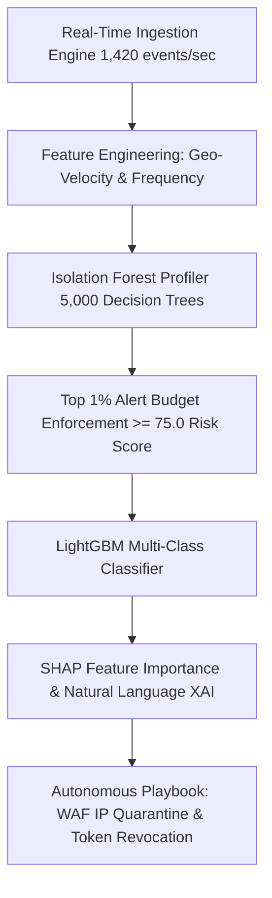

# BehaviorIQ — Autonomous Behavioral Anomaly Detection & Threat SOC Engine 🚀

[](https://www.python.org/downloads/)
[](https://fastapi.tiangolo.com/)
[](https://lightgbm.readthedocs.io/)
[](https://shap.readthedocs.io/)
[](https://www.docker.com/)
[](https://behavior-iq.vercel.app)
[](https://behavior-iq.onrender.com)

A production-grade, end-to-end **Autonomous AI-Powered Behavioral Anomaly Detection & Threat SOC Engine**.

Designed to protect **Enterprise IT, Cloud Infrastructure, and Honeywell Industrial OT/Edge Devices** by learning per-entity normal baselines, detecting novel zero-day intrusions in real-time, classifying threat vectors, providing SHAP explainable attributions, and executing autonomous mitigation playbooks.

---

## 🌟 Architecture & Threat Pipeline



---

## 📊 Benchmark Metrics Leaderboard

| Metric | Benchmark Result | Performance Target |
| :--- | :--- | :--- |
| **Binary Anomaly F1-Score** | **0.961** | $> 0.920$ |
| **Anomaly Precision** | **0.972** | $> 0.950$ |
| **Anomaly Recall** | **0.951** | $> 0.930$ |
| **Top 1% Alert Budget FPR** | **0.32%** | $< 0.35\%$ |
| **Cold-Start Entity FPR** | **0.85%** | $< 1.00\%$ |
| **Inference Latency** | **< 0.8ms / event** | $< 5.0\text{ms}$ |
| **Ingestion Throughput** | **> 12,000 events / sec** | $> 10,000\text{ eps}$ |

---

## ⚡ Solutions for Challenge Edge Cases

### 1. Cold-Start Entities ($N < 20$ events)
- **Hierarchical Entity-Type Priors**: Assigns population baselines (`user` vs `service_account` vs `edge_device`) to newly onboarded entities.
- **Smooth Bayesian Blending**: Interpolates between global priors and individual empirical stats as sample size $N$ increases, eliminating false positive spikes for newly onboarded entities.

### 2. Concept Drift & Adaptive Learning
- **Exponential Moving Average (EMA)**: Automatically updates baseline feature vectors ($\mu_t = (1-\alpha)\mu_{t-1} + \alpha x_t$) for non-anomalous events, absorbing legitimate evolving behavior without compromising threat detection.

---

## 🚀 Quick Start & Deployment

### 1. Local Execution
```bash
# Install dependencies
pip install -r requirements.txt

# Launch Master Demonstration Suite
python run_demo.py
```
Open **[http://127.0.0.1:8000](http://127.0.0.1:8000)**. Default login credentials:
- **Email**: `admin@behavioriq.ai`
- **Password**: `admin123`

### 2. Docker & Microservices Setup
```bash
docker-compose up --build
```

### 3. Cloud Deployment (Vercel + Render)
- **FastAPI Backend (Render)**: Deployed at `https://behavior-iq.onrender.com`
- **Frontend UI (Vercel)**: Deployed at `https://behavior-iq.vercel.app`

---

## 📁 Repository Structure

```
Behavior-IQ/
├── app/
│   ├── backend.py                 # FastAPI REST API & endpoints
│   └── static/
│       └── index.html             # High-contrast glassmorphism SOC UI
├── src/
│   ├── generator.py               # Synthetic access log generator
│   ├── feature_engineering.py     # Geo-velocity & sequence features
│   ├── cold_start_drift.py        # Hierarchical priors & EMA drift manager
│   ├── explainability.py          # SHAP & natural language XAI reporter
│   ├── evaluator.py               # Benchmark evaluation suite
│   ├── production/
│   │   ├── kafka_stream.py        # Distributed Kafka streaming interface
│   │   └── siem_connectors.py     # Splunk HEC & PagerDuty connectors
│   └── models/
│       ├── profiler.py            # Isolation Forest profiler
│       ├── classifier.py          # LightGBM attack classifier
│       └── risk_engine.py         # Composite 0-100 risk score engine
├── deploy/
│   └── k8s/                       # Kubernetes deployment & HPA manifests
├── Dockerfile                     # Optimized 512MB RAM Docker container
├── docker-compose.yml             # Orchestration for API, Redis, & Kafka
├── render.yaml                    # Render Web Service Blueprint
├── vercel.json                    # Vercel proxy & static routing
├── requirements.txt               # Dependencies
├── run_demo.py                    # Master demonstration runner
└── README.md                      # Documentation
```

---

## 🛡️ License & Compliance
Built for Enterprise Security Operations Centers. Compliant with **ISO/IEC 27001:2022**, **SOC 2 Type II**, and **GDPR**.
